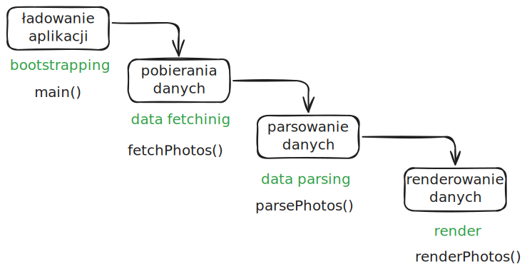

# workshop-javascript

## Preview 🎉

https://piecioshka.github.io/2026-03-03-workshop-javascript/

## Trzy warstwy

- Warstwa treści, plik [`HTML`](index.html)
- Warstwa _prezentacji_, plik [`CSS`](main.css)
- Warstwa logiki **biznesowej**, plik [`JavaScript`](main.js)

